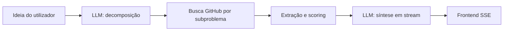

# CodeLens

Aplicação web de **pesquisa em código no GitHub** orientada a ideias de projeto: você descreve o que quer construir, o backend **quebra a ideia em subproblemas técnicos**, busca repositórios reais, **ranqueia trechos** e gera um **plano de arquitetura e reutilização** com análise em *streaming* (resposta token a token).

---

## Sumário

- [Funcionalidades](#funcionalidades)
- [Como funciona](#como-funciona)
- [Stack](#stack)
- [Requisitos](#requisitos)
- [Configuração](#configuração)
- [Executar com Docker](#executar-com-docker)
- [Desenvolvimento local](#desenvolvimento-local)
- [API](#api)
- [Estrutura do repositório](#estrutura-do-repositório)
- [Limitações e dicas](#limitações-e-dicas)

---

## Funcionalidades

- **Modo projeto**: decomposição automática (3 a 5 subproblemas) com linguagem e extensão de ficheiro detetadas a partir do texto.
- **Busca na [GitHub Code Search API](https://docs.github.com/en/rest/search/search#search-code)**: consultas otimizadas por subproblema, com limite de repositórios e ficheiros por repositório (configurável).
- **Extração e pontuação**: *snippets* de uso, imports e scores para priorizar o que entra na síntese.
- **Interface**: chat com Markdown, painel de estatísticas (línguas, repositórios, subproblemas), *streaming* da análise final.
- **Healthcheck** para orquestração (ex.: `docker compose` a aguardar o backend).

---

## Como funciona



1. **Decomposição** (OpenRouter): a ideia vira `language`, `extension` e uma lista de `subproblems` com `name`, `description` e `query` (queries estilo GitHub com filtro `extension:xx`).
2. **Pesquisa** (GitHub): para cada subproblema, código é obtido, com deduplicação por repositório e limites (`SEARCH_MAX_*`).
3. **Extração e pontuação**: o serviço de *extractor* e *scorer* prepara `FileExtract` (imports, *snippets*, scores).
4. **Síntese** (OpenRouter, *streaming*): o **synthesizer** produz um plano prático (trechos curtos, sem código repetido) com base nos melhores extracts por subproblema.

O frontend consome eventos **Server-Sent Events** (SSE) com tipos: `status`, `decomposition`, `stats`, `token`, `error`, `done`.

---

## Stack

| Camada   | Tecnologias |
| -------- | ----------- |
| Backend  | Python 3.11, FastAPI, Uvicorn, HTTPX, Pydantic, python-dotenv |
| LLM      | [OpenRouter](https://openrouter.ai/) (modelo por defeito configurável) |
| GitHub   | REST API (código, conteúdo de ficheiros, *rate limit*) |
| Frontend | React 18, Vite 5, Tailwind CSS, react-markdown |
| Conteúdo | Docker, Docker Compose |

---

## Requisitos

- **Docker** e **Docker Compose** (caminho recomendado), **ou**
- **Python 3.11+**, **Node.js 20+** (para desenvolvimento sem container).
- **Chave [OpenRouter](https://openrouter.ai/)** — obrigatória para decomposição e síntese.
- **Token pessoal do GitHub** — **altamente recomendado** (limites de API muito superiores à busca anónima).

---

## Configuração

1. Copie o exemplo de ambiente:

   ```bash
   cp .env.example .env
   ```

2. Edite `.env`:

   | Variável | Obrigatório | Descrição |
   | -------- | ------------- | -------- |
   | `OPENROUTER_API_KEY` | Sim | Chave API OpenRouter. |
   | `GITHUB_TOKEN` | Fortemente recomendado | [Personal access token](https://github.com/settings/tokens) com acesso de leitura à API. |
   | `OPENROUTER_MODEL` | Não | Modelo (predefinição: `minimax/minimax-m2.5:free` no código). |
   | `SEARCH_MAX_REPOS` | Não | Máximo de repositórios distintos a considerar (predefinição: `30`). |
   | `SEARCH_MAX_FILES_PER_REPO` | Não | Máx. ficheiros por repositório (predefinição: `5`). |
   | `SEARCH_MAX_LINES_PER_FILE` | Não | Máx. linhas por ficheiro (predefinição: `50`). |

3. O Compose injeta `.env` no serviço **backend**. O **frontend** usa `VITE_API_URL=http://localhost:8000` (definido no `docker-compose.yml`) para apontar para a API.

---

## Executar com Docker

Na raiz do repositório:

```bash
docker compose up --build
```

- **API**: <http://localhost:8000> (documentação interativa: <http://localhost:8000/docs>)
- **Frontend (Vite dev)**: <http://localhost:5173>

O serviço `frontend` aguarda o *healthcheck* do `backend` antes de arrancar. Abra o frontend no browser e descreva uma ideia de projeto (10 a 1000 caracteres, conforme validação do backend).

---

## Desenvolvimento local

### Backend

```bash
cd backend
python -m venv .venv
# Windows: .venv\Scripts\activate
# Linux/macOS: source .venv/bin/activate
pip install -r requirements.txt
# Na raiz do repo ou em backend, com .env preenchido:
uvicorn app.main:app --reload --host 0.0.0.0 --port 8000
```

Certifique-se de que as variáveis (por exemplo `OPENROUTER_API_KEY`) estão disponíveis no ambiente ou carregues `.env` na raiz; o `app/config.py` usa `load_dotenv()`.

### Frontend

```bash
cd frontend
npm install
# Opcional, se a API não estiver em 127.0.0.1:8000:
# set VITE_API_URL=http://127.0.0.1:8000
npm run dev
```

CORS no backend está restrito a `http://localhost:5173` e `http://127.0.0.1:5173`.

### Build de produção (frontend)

```bash
cd frontend
npm run build
npm run preview
```

Ajuste `VITE_API_URL` em tempo de build se a API estiver noutro *host*.

---

## API

| Método | Caminho | Descrição |
| ------ | ------- | ---------- |
| `GET`  | `/health` | `{"status":"ok"}` — usado para *healthcheck*. |
| `POST` | `/api/project/stream` | Corpo JSON: `{"idea": "..."}`. Resposta: **text/event-stream** (SSE) com eventos JSON `{ type, data }`. |

**`idea`**: 10 a 1000 caracteres (Pydantic).

**Tipos de eventos (campo `type`)**:

- `status` — mensagem de progresso.
- `decomposition` — lista de subproblemas (`name`, `description`, `query`).
- `stats` — `SearchStats` (totais, línguas, repositórios, subproblemas, `detected_language`, etc.).
- `token` — *chunk* de texto da síntese (Markdown).
- `error` — mensagem de erro (pode ocorrer sem abortar a visualização de estatísticas, conforme a situação).
- `done` — fim do fluxo.

HTTP **429** (GitHub *rate limit*) é tratado no frontend com mensagem amigável.

---

## Estrutura do repositório

```
case-mazal/
├── .env.example          # Exemplo de variáveis
├── docker-compose.yml    # Backend (8000) + frontend (5173)
├── backend/
│   ├── app/
│   │   ├── main.py       # FastAPI, CORS, /health, router /api
│   │   ├── config.py     # Env e limites
│   │   ├── models/schemas.py
│   │   ├── routes/search.py  # /project/stream
│   │   └── services/     # decomposer, github, extractor, scorer, llm, synthesizer
│   ├── Dockerfile
│   └── requirements.txt
└── frontend/
    ├── src/
    │   ├── App.jsx
    │   ├── components/   # SearchBar, ChatWindow, StatsPanel
    │   └── lib/api.js   # streamProject, VITE_API_URL
    ├── Dockerfile
    ├── package.json
    └── vite.config.js / tailwind …
```

---

## Limitações e dicas

- **Rate limits do GitHub**: a API de *search* e *code* têm limites; sem token, os limites são baixos. Com token, a experiência costuma ser estável. Em caso de 429, o frontend avisa; espere o *reset* ou use token com quotas adequadas.
- **Pesquisa pública**: apenas código indexado pela pesquisa pública do GitHub; repositórios privados não entram.
- **Qualidade da decomposição e síntese**: depende do modelo OpenRouter e da clareza da ideia. Se não aparecer código, tente **reformular a ideia** (palavras-chave de *libraries* ou padrões concretos).
- **Não comitar `.env`**: contém segredos; use apenas `.env.example` no repositório.

---

## Nome e produto

**CodeLens** — *Deep research in GitHub code — with streaming analysis* (cabeçalho da UI).
